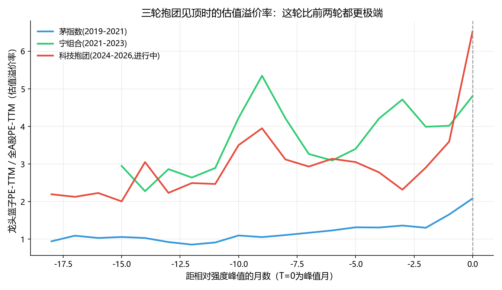
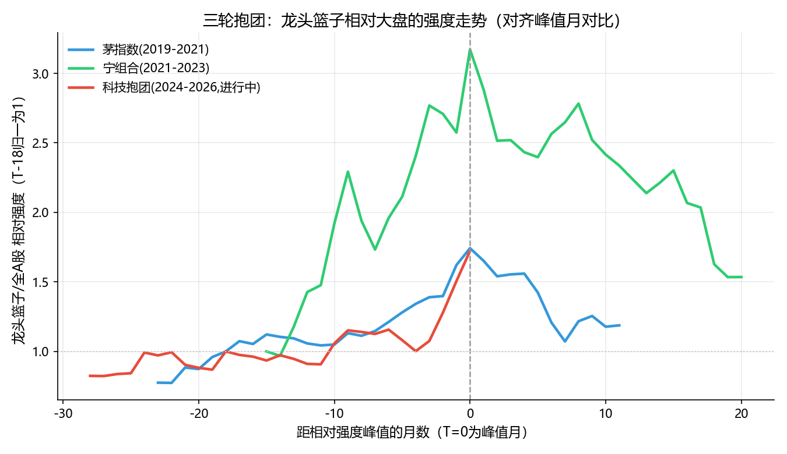

每次抱团行情崩盘前，都有人说"这次不一样"

A股这些年经历过好几轮"抱团行情"：2019到2021年是"茅指数"，一堆各行业龙头股票被资金一起买上天；2021到2022年换成了"宁组合"，新能源、光伏、锂电池的股票轮番创新高；最近这半年多，轮到了AI算力和半导体。每一轮抱团后期，市场里总会有人讲同一句话——"这次不一样，逻辑变了，估值贵是有道理的"。然后呢？前两轮都崩了，跌幅超过三成，耗时最长接近两年才磨到底部。

我这次没打算靠印象或者网上搜的成分股名单来聊这个事，而是直接用本地的历史行情、估值、财务数据，把三轮抱团的走势、估值、资金集中度全部用数字摆出来，看看这几轮到底有没有共同的规律，"这次不一样"这句话经不经得起数据检验。

## 一、别信我的记忆，让数据自己去找"龙头"

"茅指数""宁组合"这两个名字，压根不是交易所的官方指数，是市场自己起的外号，各家机构统计的成分股名单都不太一样。如果我凑着记忆写一份名单，很容易带入"事后已经知道谁是赢家"的偏差——比如我肯定会把宁德时代放进宁组合，但如果倒回2020年年初，谁能百分百确定它会成为核心资产？

所以我换了个更硬的办法：不认名单，认**市值排名**。在申万行业分类里，圈定几个跟"茅指数""宁组合""科技抱团"沾边的行业池子（比如食品饮料、家电、医药对应茅指数；电池、光伏、锂电池对应宁组合；半导体、计算机、通信对应这轮科技抱团），然后每个月按总市值重新排一次名，取池子里市值前10的股票，作为当月的"龙头篮子"。名单每月滚动更新，不是一份从头到尾不变的静态清单。

这套方法算出来的名单，跟大家平时聊的"抱团股"几乎一模一样。2021年年中的茅指数篮子里，排前面的是贵州茅台、中国平安、五粮液、中国人寿、迈瑞医疗；2021年年底的宁组合篮子是宁德时代、比亚迪、隆基股份、亿纬锂能、阳光电源、赣锋锂业；现在这轮科技抱团篮子，排在前面的是中芯国际、寒武纪、海光信息、北方华创、兆易创新。这几个名字大家应该都不陌生——说明"用市值动态排名找龙头"这个思路是靠得住的，不需要靠人脑去凑名单。

## 二、三轮抱团，见顶那一刻业绩都还挺好

我按月给每个篮子算了三件事：龙头篮子相对全市场的净值强度（抱团程度的直接结果）、龙头篮子的市值加权PE-TTM（贵不贵）、龙头篮子成交额占全A股的比重（资金有多集中）。

最扎眼的一个发现是：**三轮行情净值相对强度触顶的那个月，公司的业绩增速都还在历史高位**，没有一次是"业绩先变差、股价才跌下来"。真正压垮抱团的，从来不是基本面突然崩了，而是**估值涨到扛不住了**。

具体数字摆出来看：

- 茅指数见顶那月（2021年1月），龙头篮子PE-TTM是57倍，是当时全A股中位数PE的**2.08倍**
- 宁组合见顶那月（2021年10月），龙头篮子PE-TTM冲到130倍，溢价率一度到过**4.81倍**
- 这轮科技抱团（截至2026年6月末），龙头篮子PE-TTM已经到了167倍，溢价率**6.53倍**——三轮里最夸张的一次

图1：三轮抱团在见顶前18个月内的估值溢价率走势——这轮科技抱团的溢价率明显比前两轮更极端

估值涨这么快，靠的是什么支撑？我查了一下这轮科技抱团篮子的净利润增速中位数，账面上看是同比+89.7%，看起来很猛，但拆开一看，这个数字基本是被寒武纪、华虹宏力、兆易创新几只极端个股拉起来的（同比涨幅几百个百分点），篮子里还有中国移动同比是**负**的。用几只股票的爆发式增长撑起整个板块的估值叙事——这跟宁组合后期的情况几乎一个模子刻出来的。

## 三、崩不是一次崩完，是"急跌+磨底"分两段走

把三轮行情对齐到"距离各自净值相对强度峰值的月数"，画在同一张图上看：

图2：三轮抱团龙头篮子相对全A股的净值强度走势，T=0为各自的相对强度峰值月

两条已经走完全程的曲线（茅指数、宁组合）有个共同的形态：见顶之后先是一波急跌，跌个大几个月，把最泡沫化的估值先挤掉一截；然后进入一段横盘或者反复拉锯的"磨底"期，很多人这时候会觉得"跌够了、该抄底了"；结果磨了大半年到一年多之后，又跟着基本面真正走弱（宁组合对应的是2023年锂电池、光伏产能过剩、组件价格战），补上第二轮更深的下跌。

拿具体数字说：

- 茅指数见顶后6个月内，相对强度回撤了38.5%
- 宁组合见顶后2个月先快速跌了20%，之后横盘了将近一年，直到2023年上半年才补跌到-51.6%，全程走了19个月

也就是说，**光看第一波急跌就判断"跌透了、可以抄底了"，历史上两次都判断早了**。真正的底往往要等到基本面的故事被证伪之后才会出现。

## 四、这一轮，可能已经在半路上了

写这篇文章的时候是2026年7月底，"科技抱团"这轮从月度数据上看还在创新高（6月末相对强度还是历史高点）。但我用日线数据往后多看了一个月：拿6月末确定的龙头名单（不换仓），一直算到7月29日——**这个篮子7月以来跌了19%，同期全A股中位数只跌了7.8%**。半导体ETF（经过份额分拆复权处理后）从7月2日的高点到7月29日，跌幅达到62%，方向跟龙头篮子完全一致，只是波动更极端。

换句话说，用真实数据看，这轮科技抱团的顶大概率已经出现在2026年6月末到7月初，现在正处在历史上茅指数和宁组合都经历过的那个"急跌阶段"——而急跌阶段结束，往往还有磨底期在后面等着，不代表已经跌透了。

## 写在最后

"这次不一样"这句话，每一轮抱团行情的后期都会有人说，逻辑也永远听起来很扎实——白酒有消费升级，新能源有能源革命，AI有算力革命。故事都是真的，但故事讲得再好，也没法让估值一直涨上天而不回头。

回头看这三轮数据，判断抱团有没有到头，真没必要去猜"这次的故事是不是真的不一样"，倒是可以盯紧三个更硬的信号：估值溢价率是不是冲到了历史级的极端分位、资金集中度是不是见顶钝化、板块整体的业绩增速是不是开始靠少数几只股票的极端值撑场面而不是普遍性变好。这三个信号，茅指数和宁组合见顶前都同时亮过灯，现在这轮，三个灯好像也都亮着。

<blockquote>故事从来不会不一样，会变的只是这次轮到了谁。</blockquote>
